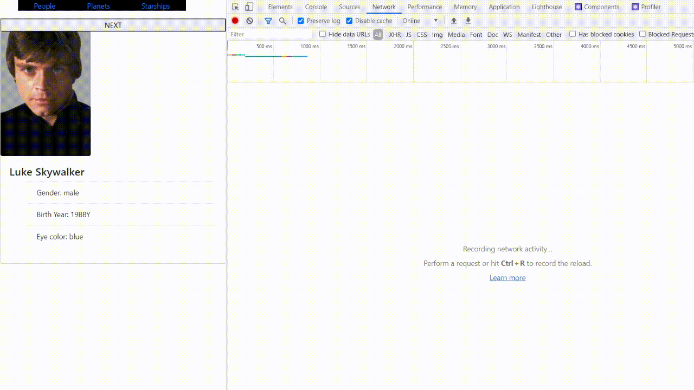

# React practical

## The tasks of the topic Ajax:

### Task 1
Create Star Wars database application.
Use [swapi.dev](https://swapi.dev/) for data and [starwars-visualguide.com](https://starwars-visualguide.com/) for images.

Application should show:
- image with SW person
- h3 tag with name
- li elements with:  
  - Gender
  - Birth Year
  - Eye color
- You can display other properties of a person, but less than 8
- Button "Next". It loads the next person.

### Task 2
Do the same with "Planets" and "Starships".
Their data cards should also display corresponding image, h3 tag with name and at least 3 data fields and not more than 6 fields.
Planets data card should display:
 - population
 - orbital period
 - diameter  

Starships data card should display:
 - model
 - manufacturer
 - cost in credits  

You can use captions for displayed data to your liking   
You can display other properties of a planet or a starship, but less than 8

### Task 3
At the top of the page, add a Header component with menu items 
 - *People*
 - *Planets*
 - *Starships*

When you click on the corresponding header menu, only the info for selected entity is rendered.   
People is rendered by default

### Task 4
Take out work with ajax and data formatting into the `services/swDataHandler` file.  
This service should have named export of **getData** function. This function should:
 - take entity id as a first argumant
 - take entity type as a second argument ('people', 'planets' or 'starships')
 - return an object with property *name* and other properties containing info that is required to display
 - if request fails, **getData** should return an object with a property that has "not availavle" value.

#### getData must not work with image urls

 You can create any additional functions in the service if needed, but getData should be the only exported function.

### Additional requierements:
- use axios library for ajax
- In case if there was not requested entity (ajax request was unsuccessful) card should render "not available" in place of name (inside h3 tag)
- You are free in styles. Make the app prettier than the gif 8-)